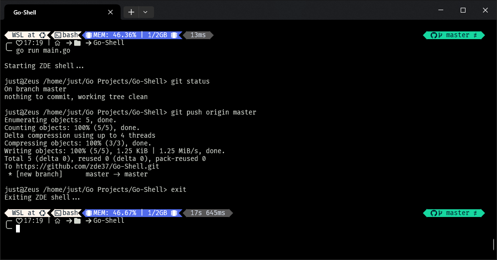

# Go shell 

### A minimalistic Unix shell written in Golang

## How To Use
Clone the project
```sh
git clone https://github.com/zde37/Go-Shell.git
```

Navigate to the root directory and run:
```sh
go run main.go
```

## PS: This repo was pushed using the shell :)
